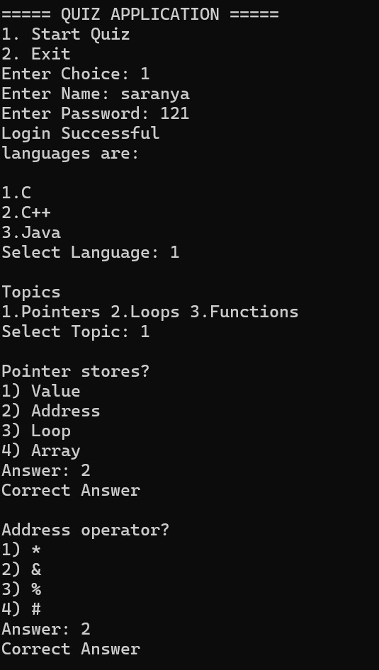
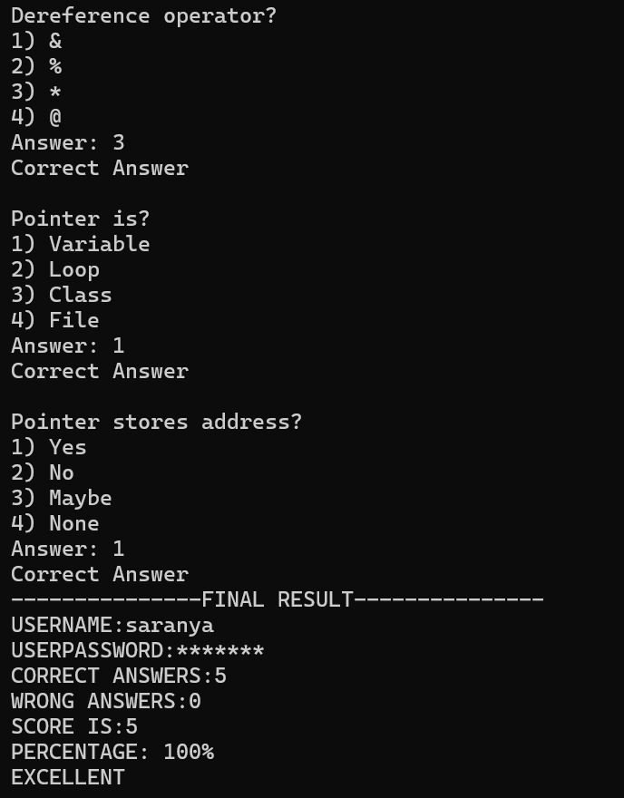
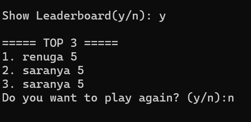

## 🚀 Features:
- User login system. 
- Multiple-choice quiz system. 
- Language and topic selection. 
- Score calculation. 
- File handling using leaderboard.txt and result.txt.
- Stores and displays Top 3 leaderboard. 

- ## 📂 File Handling:
The program automatically creates and updates:

- leaderboard.txt → Stores usernames and scores. 
- result.txt → Stores detailed quiz results. 

These files help store data permanently even after the program exits.

## ▶️ How to Run:
1. Compile the program using any C++ compiler (g++). 
2. Run the executable file. 
3. Enter your name and password. 
4. Select language and topic. 
5. Answer quiz questions and view results. 
6. ## 📸 Output Screenshots

### Output 1 - Quiz Start

### Output 2 - Question Section

### Output 3 - Result & Leaderboard

